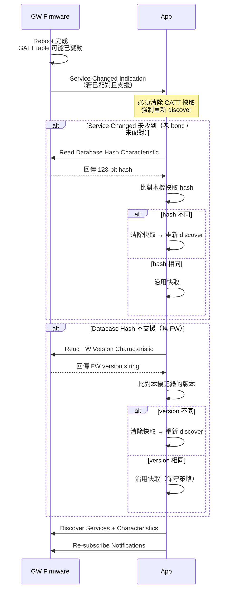

<!--
AI-DIAGRAM: required
primary_message: GW 重啟後，App 透過 Service Changed / Database Hash / FW version 三層機制重新 discover
reader: engineer
template_id: sequence-main-branch
diagram_type: sequenceDiagram
layout: left-to-right
max_nodes: 5
max_groups: 3
keep: GW重啟觸發、Service Changed indicate、Database Hash check、FW version fallback、App re-discover
avoid: GATT底層ACK細節、reconnect流程、BLE pairing
-->

# GATT 快取失效三層機制時序圖

**主訊息**：GW 重啟後，App 透過三層機制（Service Changed → Database Hash → FW version）確認是否需要重新 discover GATT。

**說明**：Service Changed 是 BLE Spec 標準機制（優先）；Database Hash 是 BLE 5.1+ 補充；FW version 比對是無 BLE 5.1 支援時的最後 fallback。三層確保 App 不會用到已過時的 GATT 快取。

**Reference**：
- Wire SSOT: `ble_api.yaml` (owner: `ble_qos_demo_V1.2m`)
- Flow: [`../flow/flow-ble-conn-lifecycle.md`](../flow/flow-ble-conn-lifecycle.md)
