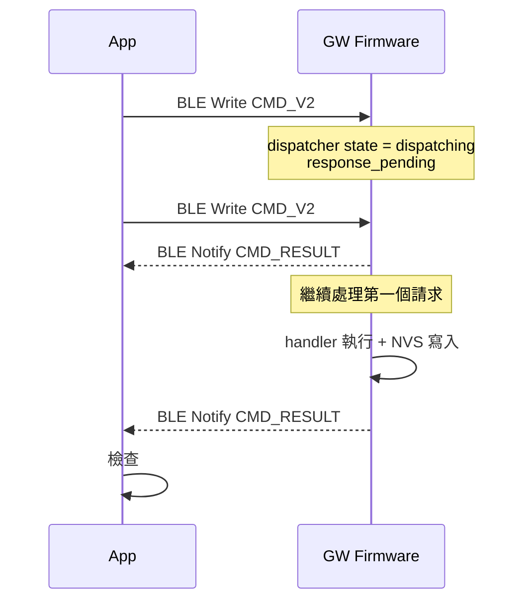

<!--
AI-DIAGRAM: required
primary_message: 當第一個 CMD_V2 in-flight 時，第二個 CMD_V2 被 GW 以 0xFD BUSY 拒絕
reader: engineer
template_id: sequence-main-branch
diagram_type: sequenceDiagram
layout: left-to-right
max_nodes: 4
max_groups: 2
keep: 第一個CMD in-flight、第二個CMD被reject 0xFD、dispatcher busy guard
avoid: TUNE-VAL細節、NVS寫入、成功路徑
-->

# CMD_V2 Reject — Busy Guard 時序圖

**主訊息**：GW dispatcher 同時只處理一個 CMD_V2；第二個請求在第一個 in-flight 期間會收到 0xFD BUSY reject。

**說明**：0xFD BUSY 是 dispatcher 層的 guard，非 handler 層的業務邏輯 reject。App 在收到 BUSY 後應等待第一個 CMD_RESULT 再重送，不應立即放棄。dispatcher 狀態機見 [`../state/state-cmd-v2-dispatcher.md`](../state/state-cmd-v2-dispatcher.md)。

**Reference**：
- Spec: [`../../feature-gw-qos-scheduler-tuning.md`](../../feature-gw-qos-scheduler-tuning.md) CMD_V2 Timeout Contract
- State: [`../state/state-cmd-v2-dispatcher.md`](../state/state-cmd-v2-dispatcher.md)
