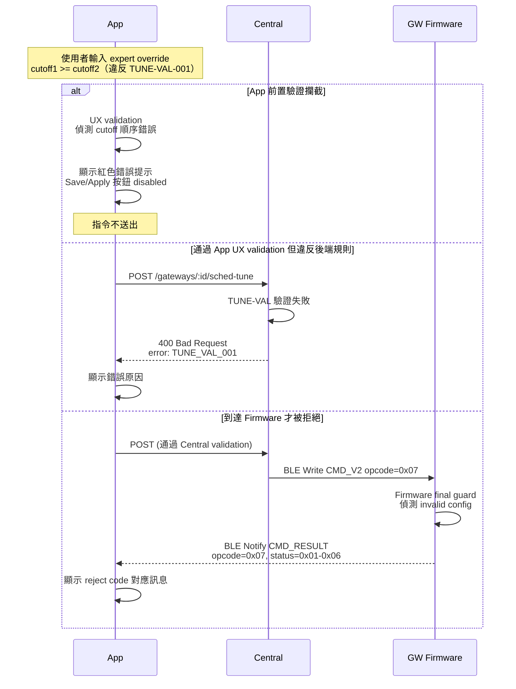

<!--
AI-DIAGRAM: required
primary_message: TUNE-VAL reject 路徑：App 或 Firmware 偵測到 validation 錯誤，指令被拒絕並告知原因
reader: engineer
template_id: sequence-main-branch
diagram_type: sequenceDiagram
layout: left-to-right
max_nodes: 4
max_groups: 2
keep: TUNE-VAL在App端的前置驗證、Central拒絕、Firmware guard reject、reject code 0x01-0x06
avoid: NVS寫入、busy guard、成功路徑
-->

# CMD_V2 Reject — TUNE-VAL 驗證失敗時序圖

**主訊息**：當 preset/expert override 違反 TUNE-VAL 規則時，App 前置攔截或 Central / Firmware reject，指令不會套用。

**說明**：三層防護（App UX → Central → Firmware）確保 invalid config 不被套用。`TUNE-VAL-004` 要求 App 端必須前置攔截，讓 UX 即時回饋。`TUNE-VAL-005` 要求 Firmware 的 final guard 必須存在，不依賴上層。

**Reference**：
- Validation rules: [`../../feature-gw-qos-scheduler-tuning.md`](../../feature-gw-qos-scheduler-tuning.md) `TUNE-VAL-001~006`
- Success 路徑: [`seq-cmd-v2-success.md`](seq-cmd-v2-success.md)
