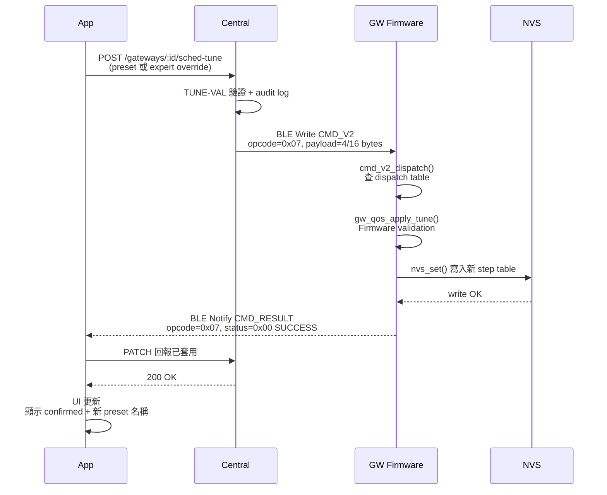

<!--
AI-DIAGRAM: required
primary_message: CMD_V2 成功路徑：App 送指令 → GW dispatch → handler 執行 → NVS 寫入 → CMD_RESULT SUCCESS 回 App
reader: engineer
template_id: sequence-main-branch
diagram_type: sequenceDiagram
layout: left-to-right
max_nodes: 5
max_groups: 2
keep: CMD_V2寫入、dispatch、NVS寫入、CMD_RESULT SUCCESS、App UI更新
avoid: BLE GATT底層ACK、reject code展開、busy guard
-->

# CMD_V2 成功路徑時序圖

**主訊息**：CMD_V2 指令從 App 發送到 GW，經 handler 處理並寫入 NVS，最後回傳 SUCCESS 並更新 App UI。

**說明**：此為 F-04 scheduler tuning 的理想路徑。NVS 寫入確保 GW 重啟後設定不遺失。CMD_RESULT 由 GW 主動 notify App（非 App polling）。reject 路徑見 [`seq-cmd-v2-reject-tune-val.md`](seq-cmd-v2-reject-tune-val.md)。

**Reference**：
- Spec: [`../../feature-gw-qos-scheduler-tuning.md`](../../feature-gw-qos-scheduler-tuning.md)
- Wire: `ble_api.yaml` opcode `0x07`
- Flow 對應: [`../flow/flow-f04-end-to-end.md`](../flow/flow-f04-end-to-end.md)
