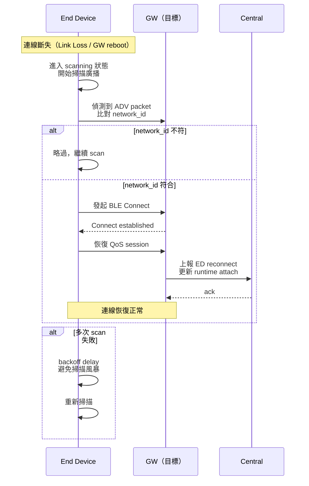

<!--
AI-DIAGRAM: required
primary_message: ED 斷線後重新掃描並根據 network_id 自動 reconnect 到正確 GW
reader: newcomer
template_id: sequence-main-branch
diagram_type: sequenceDiagram
layout: left-to-right
max_nodes: 4
max_groups: 2
keep: ED斷線、scan、network_id匹配、reconnect、backoff
avoid: GATT discover細節、CMD_V2流程、HA promotion
-->

# ED Reconnect 時序圖

**主訊息**：End Device 斷線後，透過 scan → network_id 匹配 → reconnect 自動恢復連線，backoff 避免風暴。

**說明**：ED 端以 `network_id` 為匹配 key，不綁定 GW MAC，確保 failover 後仍能自動連到新 primary GW。backoff 策略避免多台 ED 同時重連造成 radio collision。

**Reference**：
- Flow: [`../flow/flow-ble-conn-lifecycle.md`](../flow/flow-ble-conn-lifecycle.md)
- State: [`../state/state-ed-conn.md`](../state/state-ed-conn.md)
- HA context: [`seq-ha-failover.md`](seq-ha-failover.md)
