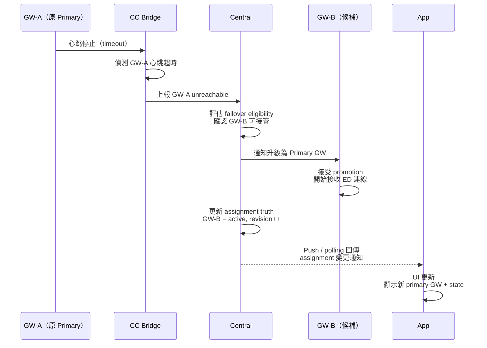

<!--
AI-DIAGRAM: required
primary_message: GW-A heartbeat timeout → CC bridge relay → GW-B 升級為 primary GW 的 HA failover 流程
reader: engineer
template_id: sequence-main-branch
diagram_type: sequenceDiagram
layout: left-to-right
max_nodes: 5
max_groups: 2
keep: GW-A心跳超時、CC bridge偵測、Central決策、GW-B promotion、App更新
avoid: hold-down timer參數、ED reconnect細節、failback流程
-->

# HA Failover 時序圖

**主訊息**：GW-A 心跳超時後，CC bridge 通報 Central，Central 決策並提升 GW-B 為 primary，App 收到更新。

**說明**：CC bridge 是 HA 架構中的監控中繼節點；Central 保有最終 failover 決策權（`FEA-004-BND-001`）。GW-A 下線後的 ED reconnect 流程見 [`seq-ed-reconnect.md`](seq-ed-reconnect.md)。failback 操作見 [`../flow/flow-failback.md`](../flow/flow-failback.md)。

**Reference**：
- Spec: [`../../feature-assignment-reconciliation.md`](../../feature-assignment-reconciliation.md)
- Architecture: [`../architecture/arch-system-overview.md`](../architecture/arch-system-overview.md)
