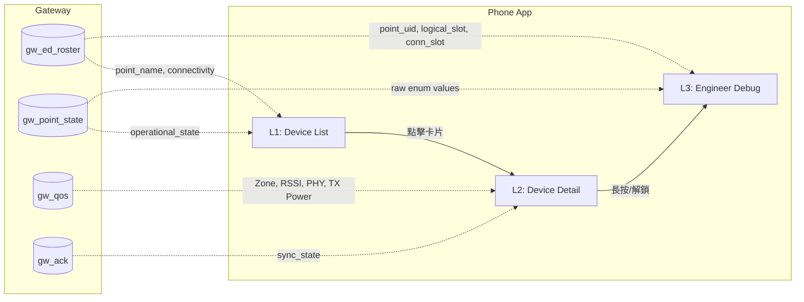
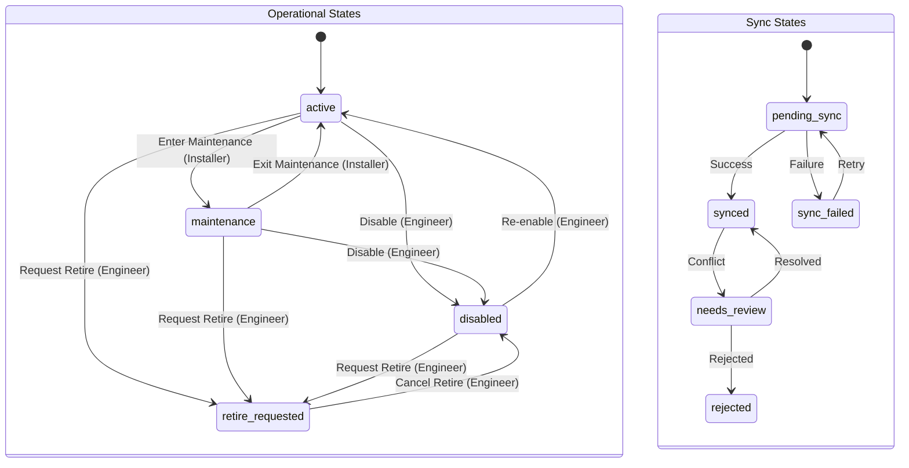
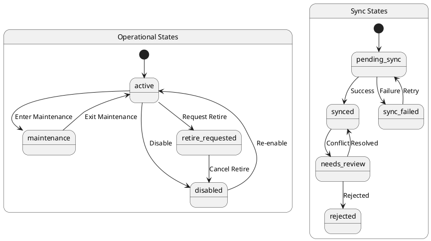
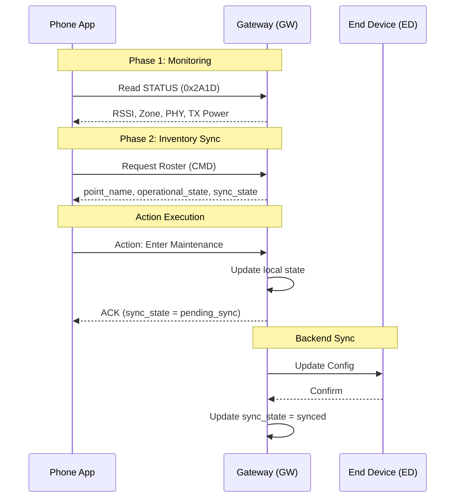
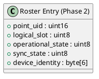

# App Display Contract 圖表原始碼與結構化說明

本文件彙整了根據 `2026-03-15-app-display-contract.md` 製作的四種技術圖表原始碼，包含 **Mermaid**、**PlantUML** 及 **結構化文字圖**。

---

## 1. 方塊圖 (Block Diagram) — 三層架構與資料來源

### Mermaid 原始碼


### 結構化文字圖
```text
[ Phone App ]                      [ Gateway ]
+-----------------------+          +-----------------------+
| L1: Device List       |<---------| gw_ed_roster (Name)   |
| (User/Patrol)         |          | gw_point_state (State)|
+-----------+-----------+          +-----------------------+
            | Click
            v
+-----------+-----------+          +-----------------------+
| L2: Device Detail     |<---------| gw_qos (RSSI/Zone)    |
| (Installer/Maint)     |          | gw_ack (Sync State)   |
+-----------+-----------+          +-----------------------+
            | Long Press
            v
+-----------+-----------+          +-----------------------+
| L3: Engineer Debug    |<---------| Full Roster Info      |
| (Dev/Debug)           |          | Raw Enum Values       |
+-----------------------+          +-----------------------+
```

---

## 2. 狀態圖 (State Diagram) — 運作與同步狀態

### Mermaid 原始碼


### PlantUML 原始碼


---

## 3. 時序圖 (Sequence Diagram) — App 與 GW 互動

### Mermaid 原始碼


---

## 4. 封包圖 (Packet Diagram) — GATT 資料結構

### 結構化文字圖 (GATT STATUS 0x2A1D)
```text
Byte Offset | Field Name | Description
------------|------------|---------------------------------------
0           | Header     | Control/Type Header (1 Byte)
1           | Zone       | 0:NEAR, 1:MID, 2:FAR, 3:EDGE (1 Byte)
2           | RSSI       | Signed Integer dBm (1 Byte)
3           | PHY        | 0:1M, 1:2M, 2:Coded (1 Byte)
4           | TX Power   | -8 to +8 dBm (1 Byte)
5..N        | Reserved   | Future Expansion
```

### PlantUML 原始碼 (Roster Entry Structure)

