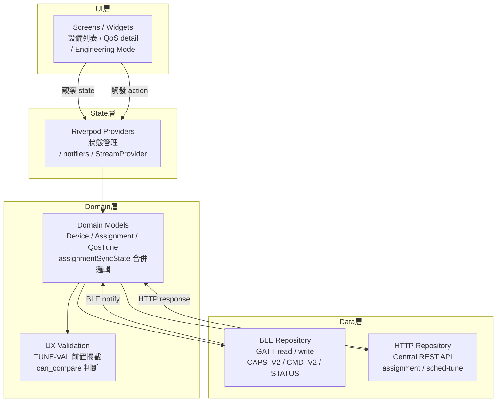

<!--
AI-DIAGRAM: required
primary_message: App 四層架構：UI / state(Riverpod) / domain / data，BLE與HTTP雙channel在data層
reader: engineer
template_id: map-source-surface
diagram_type: flowchart
layout: top-to-bottom
max_nodes: 8
max_groups: 4
keep: 四層名稱、Riverpod在state層、BLE+HTTP在data層、domain持有assignmentSyncState
avoid: Widget tree細節、Dart語法、provider命名
-->

# App 分層架構圖

**主訊息**：Flutter App 採四層架構；data 層同時管理 BLE（firmware）和 HTTP（Central）兩條 channel，domain 層合併雙來源。

**說明**：Domain 層是 BLE 與 HTTP 兩條 channel 的合併點，負責導出 `assignmentSyncState`（`FEA-004-BND-003`）。UX Validation 在 domain 層做前置攔截，錯誤不送出 BLE。

**Reference**：
- Repo: `ble_qos_app/`
- Assignment display: [`../../feature-assignment-reconciliation.md`](../../feature-assignment-reconciliation.md) `FEA-004-BND-003`
- Validation: [`../../feature-gw-qos-scheduler-tuning.md`](../../feature-gw-qos-scheduler-tuning.md) `TUNE-VAL-004`
