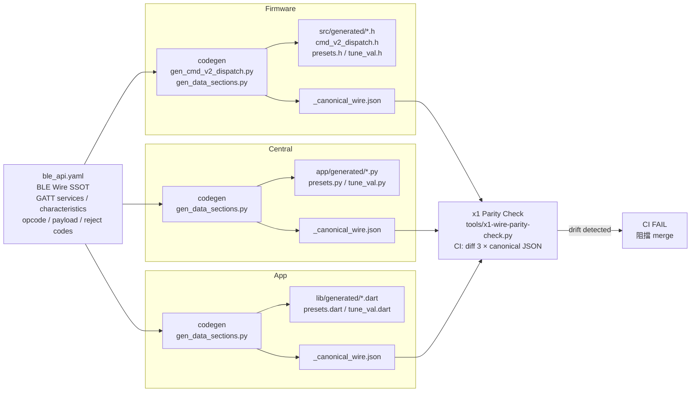

<!--
AI-DIAGRAM: required
primary_message: BLE wire SSOT：ble_api.yaml → codegen → Firmware / Central / App 三端同步
reader: engineer
template_id: map-source-surface
diagram_type: flowchart
layout: left-to-right
max_nodes: 8
max_groups: 4
keep: ble_api.yaml作為SSOT、codegen三條路徑、三端生成檔案、drift風險
avoid: GATT UUID列表、具體codegen指令、CI pipeline細節
-->

# BLE Wire SSOT 架構圖

**主訊息**：`ble_api.yaml` 是三端 BLE wire format 的唯一來源，各 repo 獨立執行 codegen，x1 CI 驗 drift。

**說明**：三端各自執行 codegen，漂移風險來自「某端忘記重跑 codegen」或「codegen 邏輯不一致」。x1 透過 canonical JSON diff 在 CI 自動驗 7 個 wire section 的 parity。SSOT 改動需重跑三端 codegen。

**Reference**：
- Wire SSOT: `ble_qos_demo_V1.2m/ble_api.yaml`
- x1 spec: [`../../x1-cross-repo-wire-parity-spec.md`](../../x1-cross-repo-wire-parity-spec.md)
- Plan: [`../../x1-cross-repo-wire-parity-plan.md`](../../x1-cross-repo-wire-parity-plan.md)
