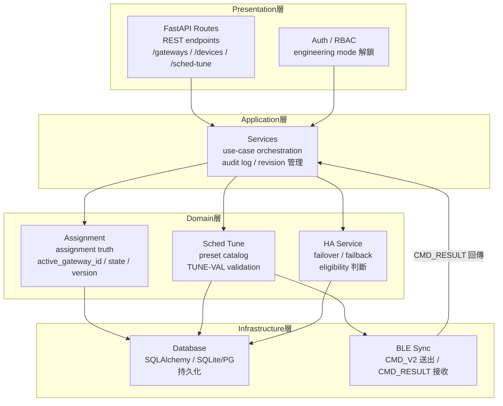

<!--
AI-DIAGRAM: required
primary_message: Central 四層架構：presentation / application / domain / infrastructure，職責分層清晰
reader: engineer
template_id: map-source-surface
diagram_type: flowchart
layout: top-to-bottom
max_nodes: 8
max_groups: 4
keep: 四層名稱與職責、FastAPI在presentation層、domain擁有assignment truth、DB/sync在infrastructure
avoid: API endpoint list、資料庫 schema細節、deployment環境
-->

# Central 分層架構圖

**主訊息**：Central（`central-device-metadata`）採四層架構；domain 層擁有 assignment truth，infrastructure 層負責持久化與同步。

**說明**：Presentation 層不直接操作 domain 物件；所有業務邏輯集中在 Domain 層，確保 assignment truth 不被繞過。`TUNE` domain 物件擁有 TUNE-VAL validation 邏輯，與 API route 解耦。

**Reference**：
- Repo: `central-device-metadata/`
- Assignment spec: [`../../feature-assignment-reconciliation.md`](../../feature-assignment-reconciliation.md)
- Sched Tune spec: [`../../feature-gw-qos-scheduler-tuning.md`](../../feature-gw-qos-scheduler-tuning.md)
