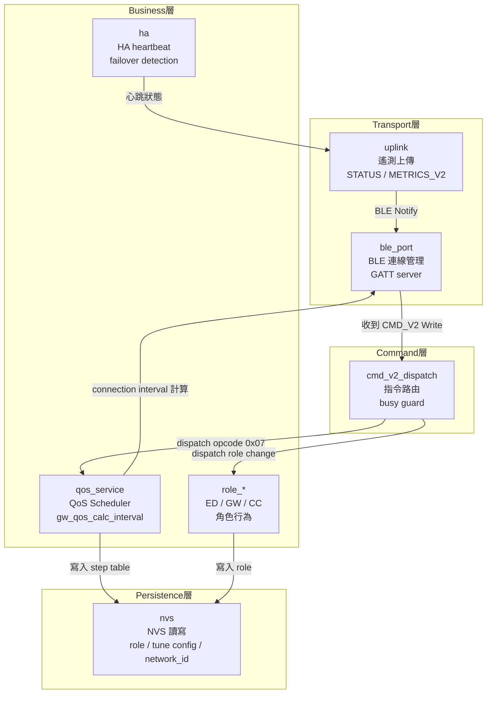

<!--
AI-DIAGRAM: required
primary_message: Firmware 模組分層：ble_port / qos_service / role_* / nvs / ha / uplink / cmd_v2_dispatch
reader: engineer
template_id: map-source-surface
diagram_type: flowchart
layout: top-to-bottom
max_nodes: 8
max_groups: 4
keep: 七個主要模組、模組間依賴方向、cmd_v2_dispatch作為指令入口
avoid: 函數級別細節、BLE GATT UUID、NCS/Zephyr API
-->

# Firmware 模組架構圖

**主訊息**：Firmware 由七個主要模組組成，`cmd_v2_dispatch` 是指令入口，`qos_service` 是核心排程邏輯，`nvs` 持久化所有設定。

**說明**：`cmd_v2_dispatch` 作為 command plane 的單一入口（Single Responsibility），解耦了 BLE transport 和業務邏輯。`nvs` 是所有持久化狀態的 SSOT，模組不直接互相讀取設定。

**Reference**：
- Wire SSOT: `ble_api.yaml` (owner: `ble_qos_demo_V1.2m`)
- State: [`../state/state-role-machine.md`](../state/state-role-machine.md)
- Dispatcher state: [`../state/state-cmd-v2-dispatcher.md`](../state/state-cmd-v2-dispatcher.md)
