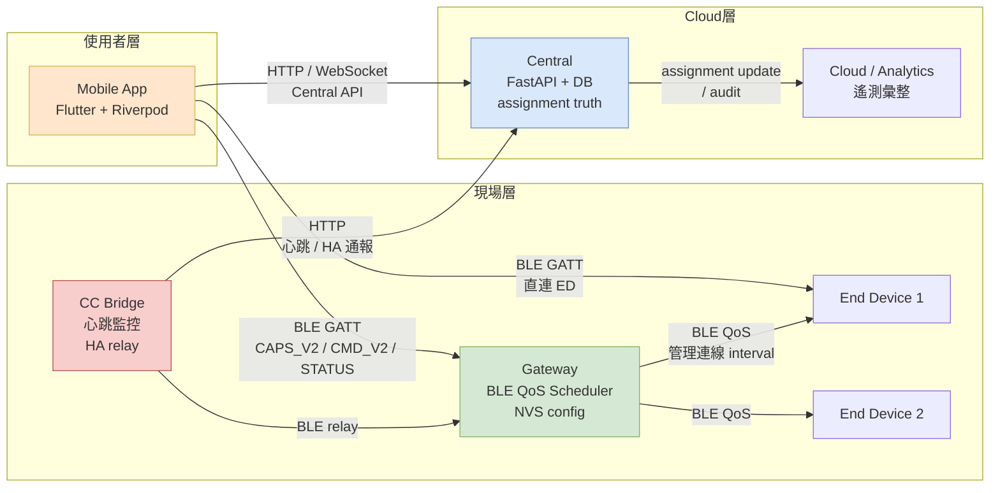

<!--
AI-DIAGRAM: required
primary_message: 系統全景：Mobile App / CC bridge / GW / ED / Central / Cloud 六個角色的位置與連線路徑
reader: newcomer
template_id: ctx-actor-authority
diagram_type: flowchart
layout: left-to-right
max_nodes: 8
max_groups: 4
keep: 六個主要角色、BLE路徑、HTTP/Cloud路徑、authority boundary
avoid: BLE GATT細節、API endpoint list、assignment reconciliation狀態
-->

# 系統全景架構圖（C4-style）

**主訊息**：BLE QoS Demo 由六個角色組成，Mobile App 同時透過 BLE 連 GW/ED、透過 HTTP 連 Central，CC bridge 作為中繼。

**說明**：Central 擁有 assignment truth；GW 擁有 runtime attach observation；App 負責呈現並協調兩者。CC bridge 是 HA 監控中繼，不擁有任何 assignment authority（`FEA-004-BND-001`）。

**Reference**：
- Authority boundary: [`../../feature-assignment-reconciliation.md`](../../feature-assignment-reconciliation.md) Authority Boundary
- Actor roles: [`../../system-actors-and-authority.d2`](../../system-actors-and-authority.d2)
- Spec overview: [`../../rml-lite.md`](../../rml-lite.md)
