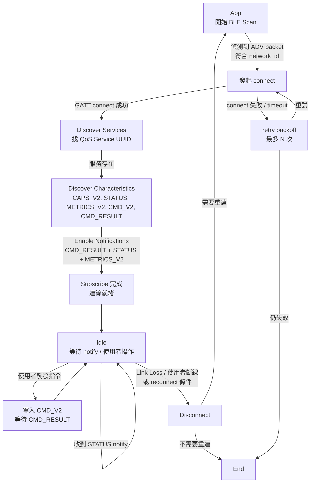

<!--
AI-DIAGRAM: required
primary_message: BLE 連線從 scan 到 subscribe 的生命週期主流程
reader: newcomer
template_id: flow-linear-gate
diagram_type: flowchart
layout: top-to-bottom
max_nodes: 8
max_groups: 2
keep: scan→connect→discover→subscribe→idle 主流程、斷線觸發點
avoid: retry backoff參數、RSSI過濾細節、多 GW 並行連線
-->

# BLE 連線生命週期流程圖

**主訊息**：App 從掃描開始，連上 GW/ED 後完成服務探索與 notify 訂閱，進入 idle 等待事件或斷線。

**說明**：此圖呈現 App 連線的主線生命週期。reconnect 路徑（ED 端）詳見 [`seq-ed-reconnect.md`](../sequence/seq-ed-reconnect.md)；服務快取失效（GW 重啟）見 [`seq-cache-invalidation-3tier.md`](../sequence/seq-cache-invalidation-3tier.md)。

**Reference**：
- Requirement: [`../../requirements.md`](../../requirements.md) `REQ-006`
- Wire SSOT: `ble_api.yaml` (owner: `ble_qos_demo_V1.2m`)
