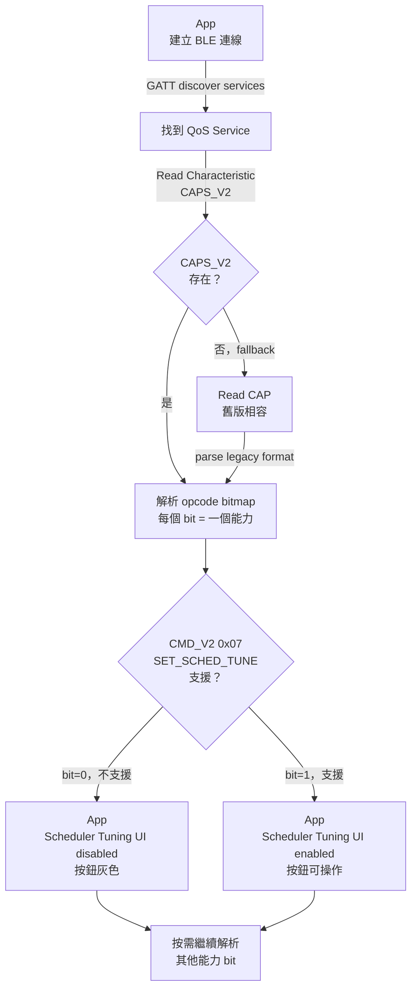

<!--
AI-DIAGRAM: required
primary_message: App 連上 GW 後讀 CAPS_V2，依能力 bitmap 決定哪些 UI 功能可用
reader: newcomer
template_id: flow-linear-gate
diagram_type: flowchart
layout: top-to-bottom
max_nodes: 8
max_groups: 3
keep: CAPS_V2讀取、opcode bitmap解析、UI enable/disable決策
avoid: BLE GATT底層細節、fallback CAP的完整邏輯
-->

# Capability Discovery 流程圖

**主訊息**：App 連上 GW 後讀取 CAPS_V2，解析 opcode bitmap，決定哪些功能按鈕可操作。

**說明**：CAPS_V2 是 App 啟動時的功能閘控來源。REQ-002 規定 App 不得暴露未宣告能力的操作——此圖展示如何落實。`CAP` fallback 是 migration 相容橋，長期目標只需 CAPS_V2。

**Reference**：
- Requirement: [`../../requirements.md`](../../requirements.md) `REQ-002`
- Spec: [`../../feature-gw-qos-extension-boundary.md`](../../feature-gw-qos-extension-boundary.md)
- Wire SSOT: `ble_api.yaml` (owner: `ble_qos_demo_V1.2m`)
