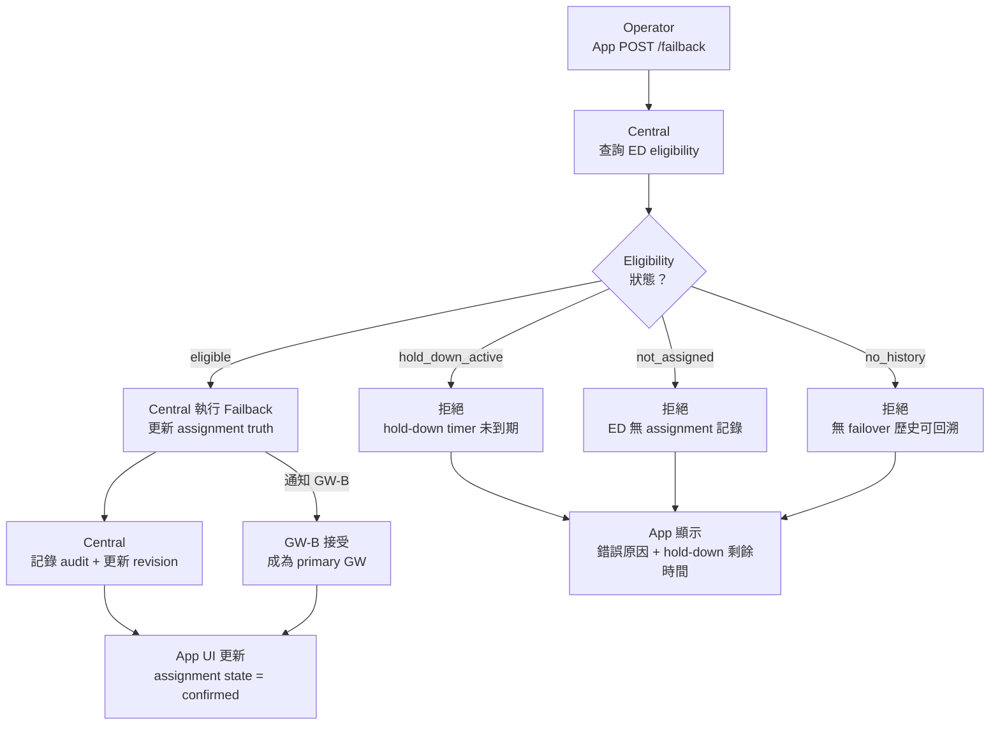

<!--
AI-DIAGRAM: required
primary_message: Operator 觸發 failback 後，Central 檢查 eligibility 決定執行或拒絕
reader: engineer
template_id: flow-dual-path-feedback
diagram_type: flowchart
layout: top-to-bottom
max_nodes: 9
max_groups: 3
keep: operator POST請求、eligibility四個狀態、execute路徑、reject路徑
avoid: hold-down timer細節、GW-B promotion內部實作
-->

# Failback 流程圖（W26A.1）

**主訊息**：Operator POST failback 後，Central 依 eligibility 狀態決定執行或拒絕，並更新 App 顯示。

**說明**：Failback 是有條件執行的操作，非隨時可觸發。`eligible` 是唯一成功路徑；其餘三種 eligibility 狀態皆為拒絕。狀態機詳見 [`state-failback-eligibility.md`](../state/state-failback-eligibility.md)。

**Reference**：
- Spec: [`../../feature-assignment-reconciliation.md`](../../feature-assignment-reconciliation.md) `W26A.1`
- State 對應: [`../state/state-failback-eligibility.md`](../state/state-failback-eligibility.md)
