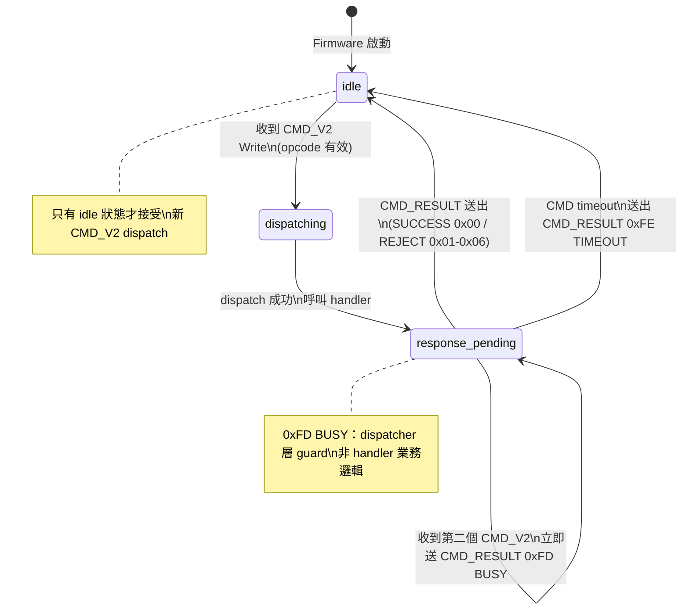

<!--
AI-DIAGRAM: required
primary_message: CMD_V2 dispatcher 狀態機：idle → dispatching → response_pending → idle，busy guard 保護並發
reader: engineer
template_id: state-dual-fsm
diagram_type: stateDiagram-v2
layout: top-to-bottom
max_nodes: 4
max_groups: 1
keep: idle、dispatching、response_pending三個核心狀態、0xFD BUSY reject、timeout回idle
avoid: TUNE-VAL業務邏輯、NVS寫入細節、reconnect流程
-->

# CMD_V2 Dispatcher 狀態機

**主訊息**：Dispatcher 同時只允許一個 CMD_V2 in-flight；第二個請求在 `response_pending` 期間收到 0xFD BUSY。

**說明**：`response_pending` 是 busy guard 保護區間。收到 BUSY 的 App 應等待第一個 CMD_RESULT 後再重送，而非放棄。timeout 後 dispatcher 自動回 idle 以防死鎖。

**Reference**：
- Spec: [`../../feature-gw-qos-scheduler-tuning.md`](../../feature-gw-qos-scheduler-tuning.md) CMD_V2 Timeout Contract
- Sequence: [`../sequence/seq-cmd-v2-reject-busy.md`](../sequence/seq-cmd-v2-reject-busy.md)
