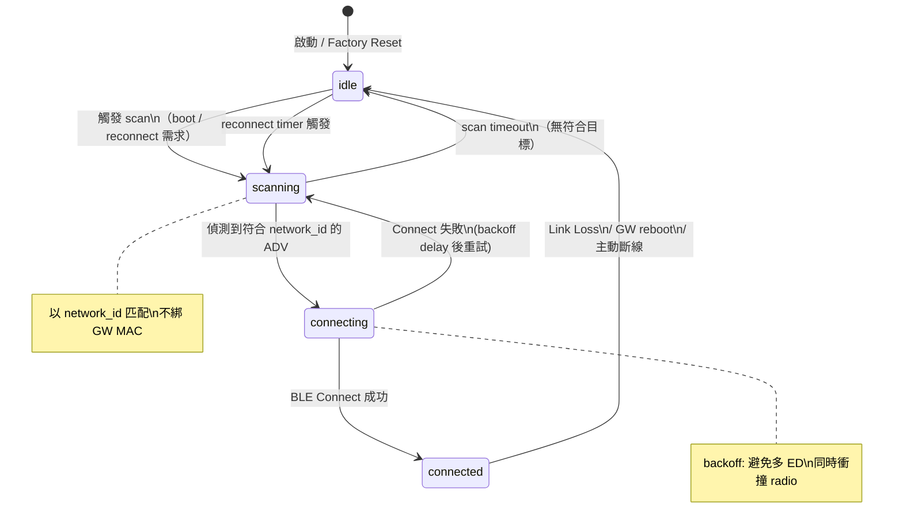

<!--
AI-DIAGRAM: required
primary_message: End Device 連線狀態機：idle → scanning → connecting → connected → idle，含 retry backoff
reader: newcomer
template_id: state-dual-fsm
diagram_type: stateDiagram-v2
layout: top-to-bottom
max_nodes: 5
max_groups: 1
keep: idle、scanning、connecting、connected四個狀態、retry backoff、斷線回idle
avoid: GATT discover細節、CMD_V2流程、GW內部scheduler
-->

# End Device 連線狀態機

**主訊息**：ED 從 `idle` 開始掃描，配對並連線後進入 `connected`；斷線後自動回 `idle` 並以 backoff 重試。

**說明**：`network_id` 匹配讓 ED 在 HA failover 後自動連到新 primary GW，不需手動重配置。backoff 在 `connecting → scanning` 轉換時生效，防止 radio 衝撞風暴。

**Reference**：
- Sequence: [`../sequence/seq-ed-reconnect.md`](../sequence/seq-ed-reconnect.md)
- Flow: [`../flow/flow-ble-conn-lifecycle.md`](../flow/flow-ble-conn-lifecycle.md)
