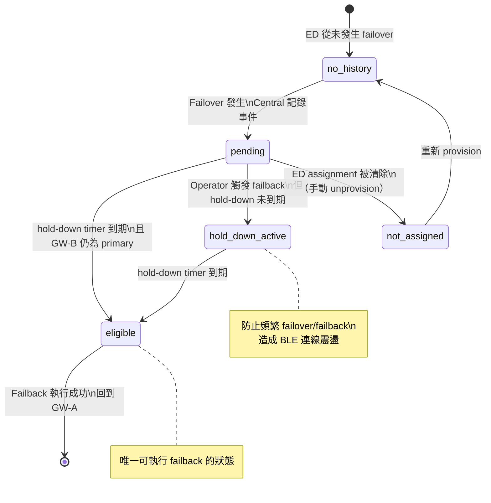

<!--
AI-DIAGRAM: required
primary_message: Failback eligibility 狀態機：四種狀態決定 failback 能否執行
reader: engineer
template_id: state-dual-fsm
diagram_type: stateDiagram-v2
layout: top-to-bottom
max_nodes: 5
max_groups: 2
keep: pending、eligible、hold_down_active、not_assigned、no_history五個狀態
avoid: failover內部機制、BLE連線細節、CMD_V2
-->

# Failback Eligibility 狀態機（W26A.1）

**主訊息**：Central 對每個 ED 維護 failback eligibility 狀態；只有 `eligible` 才允許執行 failback。

**說明**：hold-down 機制防止 failover/failback 震盪（oscillation）。`not_assigned` 代表 ED 無 assignment 記錄，需重新 provision。Flow 詳見 [`../flow/flow-failback.md`](../flow/flow-failback.md)。

**Reference**：
- Spec: [`../../feature-assignment-reconciliation.md`](../../feature-assignment-reconciliation.md) `W26A.1`
- Flow: [`../flow/flow-failback.md`](../flow/flow-failback.md)
