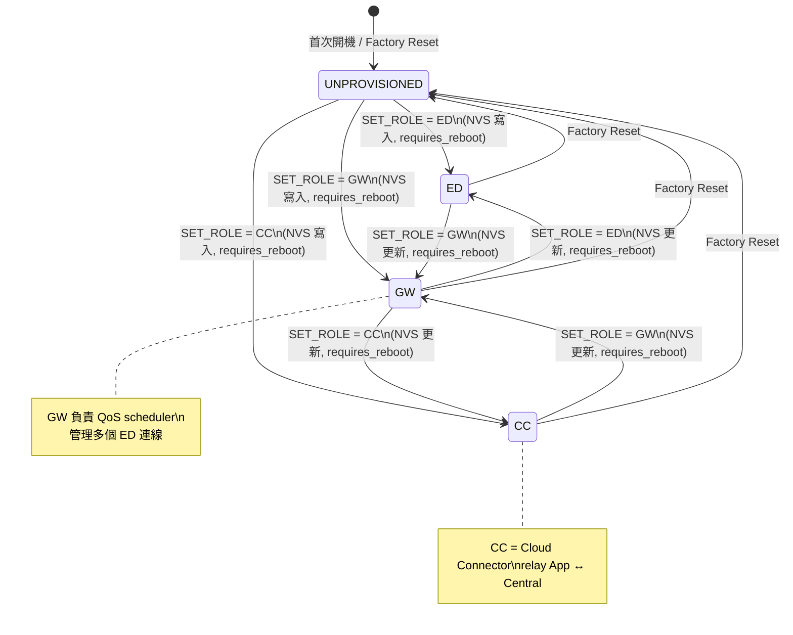

<!--
AI-DIAGRAM: required
primary_message: Firmware 節點的角色狀態機：UNPROVISIONED → ED / GW / CC，NVS 持久化，需重啟生效
reader: engineer
template_id: state-dual-fsm
diagram_type: stateDiagram-v2
layout: top-to-bottom
max_nodes: 6
max_groups: 2
keep: 四個角色狀態、NVS role轉換觸發、requires_reboot、UNPROVISIONED作為初始狀態
avoid: BLE連線細節、QoS scheduler邏輯、assignment reconciliation
-->

# Firmware 角色狀態機

**主訊息**：每個 Firmware 節點從 `UNPROVISIONED` 出發，透過 NVS role 設定轉換成 ED、GW 或 CC 角色，角色切換需重啟生效。

**說明**：角色存於 NVS，重啟後才真正生效（`requires_reboot = true`）。`UNPROVISIONED` 是任何角色 factory reset 後的歸位點。角色邊界決定哪些 CMD_V2 opcode 有效——GW 才能接受 opcode `0x07`。

**Reference**：
- Spec: [`../../feature-gw-qos-extension-boundary.md`](../../feature-gw-qos-extension-boundary.md)
- Wire SSOT: `ble_api.yaml` NVS roles section
- Cross-repo: [`../../x1-cross-repo-wire-parity-spec.md`](../../x1-cross-repo-wire-parity-spec.md) `S6`
