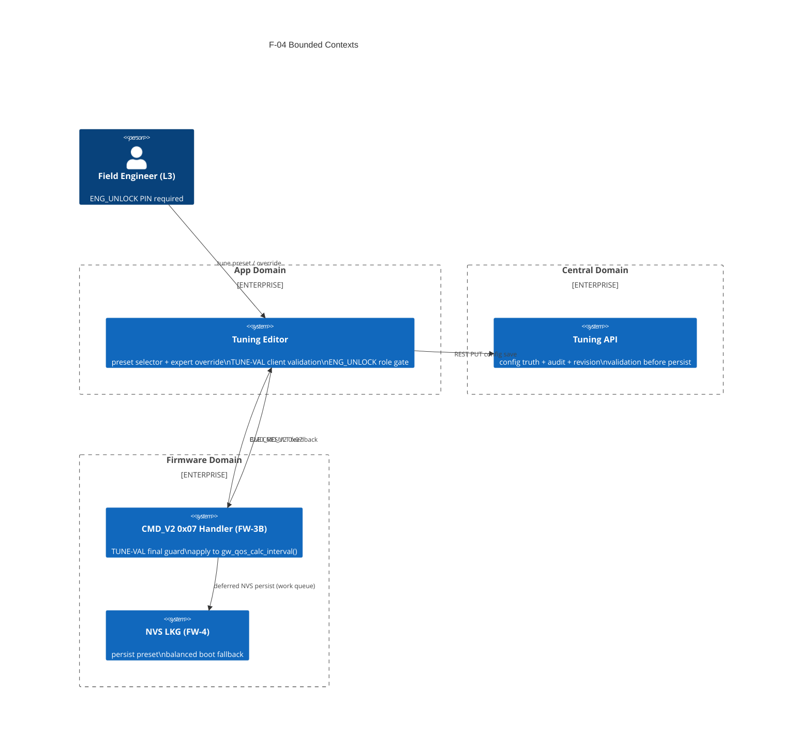

# Context Map — F-04: GW QoS Scheduler Tuning

> Feature: F-04 GW QoS Scheduler Deployment Tuning
> Source: `capability-ownership.md` RML-CAP-006, `feature-gw-qos-scheduler-tuning.md`

## Bounded Contexts

## Context Relationships

| Upstream | Downstream | Relationship | Contract |
|---|---|---|---|
| Spec-Pack (TUNE-VAL schema) | App editor | Published Language | TUNE-VAL-001~006 rules |
| Spec-Pack (TUNE-VAL schema) | Central Tuning API | Published Language | preset enum + override JSON schema |
| Spec-Pack (TUNE-VAL schema) | Firmware handler | Published Language | opcode 0x07 payload format + reject codes |
| App editor | Firmware handler | Customer/Supplier | CMD_V2 0x07 4B or 16B payload |
| App editor | Central Tuning API | Customer/Supplier | REST PUT with validation |
| Firmware handler | Central (consumer) | — | Central receives audit trail; Firmware does not push to Central directly |

## Anti-Corruption Layers

| Boundary | ACL Description |
|---|---|
| App → Firmware | App cannot send invalid payload — TUNE-VAL client guard blocks submission |
| Firmware | Final guard rejects even if App bypassed validation (defense in depth) |
| Central | Must not skip validation — no silent persist of invalid config |
| Firmware ↔ Central | These do not communicate directly in F-04; App mediates both sides |

## ADR Reference

F-04 architecture decision (BUILD_ASSERT Option A → runtime preset Option B):
`--base-dir/docs/decisions/2026-04-18-f04-runtime-preset-over-build-assert.md`
