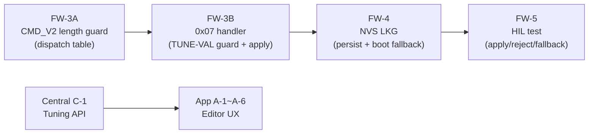

# Event Storming — F-04: GW QoS Scheduler Tuning

> Feature: F-04 GW QoS Scheduler Deployment Tuning
> Source: `feature-gw-qos-scheduler-tuning.md`, `docs/handoffs/2026-04-18-f04-wire-contract-and-observability.md`

## Domain Events

| Event | Trigger | Actor | Outcome |
|---|---|---|---|
| `PresetSelected` | Engineer taps preset in App tuning editor | App | TUNE-VAL client validate → CMD_V2 0x07 preset body sent |
| `ExpertOverrideEdited` | Engineer fills custom cutoff/interval fields | App | TUNE-VAL client validate (red error if invalid) |
| `TuneValClientValidationFailed` | TUNE-VAL-001/002/003/006 violated | App | Red error shown, Save/Apply button disabled |
| `CMD_V2_0x07Sent` | App submits valid preset or override | App → GW | GW CMD_V2 0x07 handler receives payload |
| `TuneValFirmwareRejected` | Firmware TUNE-VAL final guard fails | GW | CMD_RESULT with reject code + reason sent to App |
| `TuneValFirmwareAccepted` | Firmware validation passes | GW | `gw_qos_calc_interval()` table updated; NVS persist queued |
| `NVSPersistQueued` | Work queue deferred (CLAUDE.md rule: no NVS in GATT cb) | GW | `qos/sched_tune` written after callback return |
| `ConfigSavedToCentral` | App REST PUT success | App → Central | Central stores preset + revision + audit entry |
| `BootFallbackApplied` | NVS corrupt or missing on boot | GW | balanced preset loaded as fallback |
| `LKGRestored` | Boot with valid NVS `qos/sched_tune` | GW | last-known-good preset applied |

## Commands

| Command | Wire/API | Payload | Actor |
|---|---|---|---|
| `CMD_V2 0x07 preset form` | BLE GATT write | `{txn_id, 0x07, preset_id}` (4 bytes) | App → GW |
| `CMD_V2 0x07 expert override` | BLE GATT write | `{txn_id, 0x07, cutoffs[3], intervals[4]}` (16 bytes) | App → GW |
| `CMD_RESULT notify` | BLE GATT notify | `{txn_id, status, reject_code}` | GW → App |
| `PUT /api/v1/gw/{id}/sched-tune` | REST | preset or override JSON | App → Central |

## Aggregates

| Aggregate | State | Invariant |
|---|---|---|
| `cmd_v2_dispatch` (FW-3A) | opcode dispatch table, length guard | 0x07 length must be 4 (preset) or 16 (override) before handler called |
| `cmd_v2_sched_tune` (FW-3B) | handler + TUNE-VAL guard | Reject before apply if validation fails |
| `NVS qos/sched_tune` (FW-4) | persisted preset or override | balanced fallback if NVS missing or corrupt |
| `Central tuning store` | preset + cutoffs/intervals + revision + audit | Immutable audit log; never silently overwrite |

## Cross-Phase Dependencies

