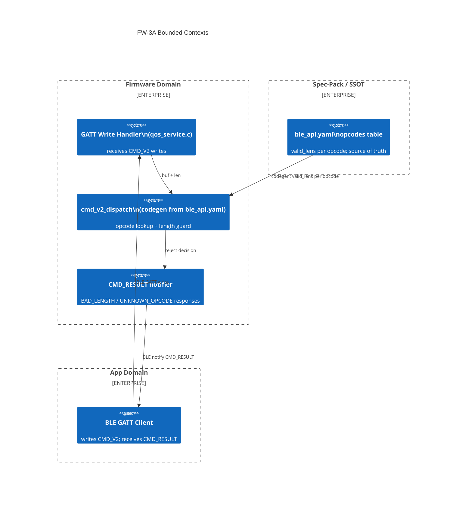

# Context Map — FW-3A: CMD_V2 Per-Opcode Length Guard

> Wave: FW-3A (firmware spec phase)
> Source: `fw3b-cmd-v2-0x07-handler-impl.md`, `ble_api.yaml`

## Bounded Contexts

## Context Relationships

| Upstream | Downstream | Relationship | Contract |
|---|---|---|---|
| `ble_api.yaml` opcodes table | `cmd_v2_dispatch.c` (codegen) | Published Language / codegen source | `valid_lens[]` per opcode; reject codes |
| `cmd_v2_dispatch.c` | `cmd_v2_ops[].handler` | Internal | Length guard must pass before handler called |
| `cmd_v2_dispatch.c` | CMD_RESULT notifier | Internal | `BAD_LENGTH 0xFF` on len mismatch |
| FW-3A dispatch infrastructure | FW-3B `0x07` handler | Prerequisite | FW-3B fills NULL slot in `cmd_v2_ops[]` |

## Anti-Corruption Layers

| Boundary | ACL Description |
|---|---|
| ble_api.yaml → codegen | Dispatch table is generated; hand-editing `cmd_v2_dispatch.c` is forbidden — edit `ble_api.yaml` only |
| GATT → dispatch | Raw GATT payload never reaches handler without length guard; guards are centralized in dispatch, not duplicated in handlers |

## Naming Disambiguation

FW-3A is a **firmware spec phase** (firmware-internal planning), not a cross-repo feature ID.
- `FW-3A` = CMD_V2 length guard infrastructure (this document)
- `FW-3B` = `0x07` SET_SCHED_TUNE handler (fills the NULL slot)
- `F-04` = cross-repo feature (GW QoS Scheduler Tuning); owner = spec-pack

See `glossary.md` §F-04 vs FW-3A disambiguation.
