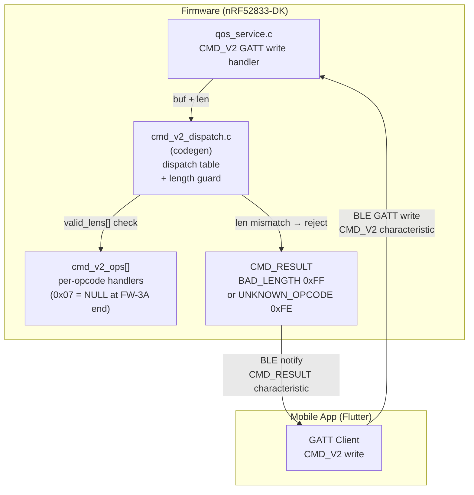

# Ecosystem Map — FW-3A: CMD_V2 Per-Opcode Length Guard

> Wave: FW-3A (Firmware spec phase; subset of F-04 firmware work)
> Source: `ble_qos_demo_V1.2m/docs/02_sdd/firmware-fw3b-impl.md` §1 Context (FW-3A prerequisite)
> Relationship: FW-3A frozen → FW-3B can start (`0x07` handler)

## Cross-Repo Actor Responsibilities (FW-3A)

| Actor | FW-3A Role | Capability Added |
|---|---|---|
| GW Firmware | CMD_V2 dispatch table + per-opcode length guard | `cmd_v2_dispatch.h`, `cmd_v2_ops[]`, `valid_lens[]` |
| App | sends CMD_V2 writes; receives CMD_RESULT | no FW-3A changes in App |
| Spec-Pack / ble_api.yaml | SSOT for valid_lens per opcode | source: `ble_api.yaml` → opcodes table |

## Key Invariants (FW-3A)

- All CMD_V2 opcodes have a registered length guard before any handler is called
- Length mismatch always returns `BAD_LENGTH 0xFF` via CMD_RESULT (no silent ignore)
- Opcode `0x07` handler is `NULL` at FW-3A completion; returns `UNKNOWN_OPCODE 0xFE` or no-op until FW-3B
- Generated dispatch table `cmd_v2_dispatch.c` is codegen artifact — source of truth is `ble_api.yaml`
