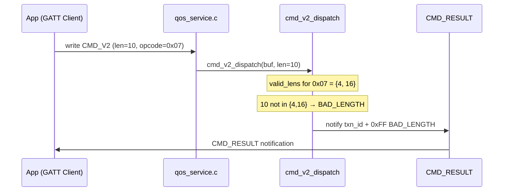

# Event Storming — FW-3A: CMD_V2 Per-Opcode Length Guard

> Wave: FW-3A (firmware spec phase)
> Source: `fw3b-cmd-v2-0x07-handler-impl.md` §1 Context, `ble_api.yaml` opcodes table

## Domain Events

| Event | Trigger | Actor | Outcome |
|---|---|---|---|
| `CMD_V2WriteReceived` | App BLE GATT write to CMD_V2 characteristic | GW GATT write handler | `qos_service.c` dispatch call |
| `LengthGuardPassed` | `len` in `valid_lens[]` for opcode | Dispatch table | Handler function called |
| `LengthGuardFailed` | `len` not in `valid_lens[]` for opcode | Dispatch table | `BAD_LENGTH 0xFF` sent via CMD_RESULT |
| `UnknownOpcodeReceived` | Opcode not in `cmd_v2_ops[]` | Dispatch table | `UNKNOWN_OPCODE 0xFE` sent via CMD_RESULT |
| `NullHandlerSlotHit` | Opcode registered but handler=NULL (0x07 at FW-3A end) | Dispatch table | `UNKNOWN_OPCODE 0xFE` or no-op |
| `CMD_ResultNotified` | Dispatch decision made | GW | App receives CMD_RESULT BLE notification |
| `FW3ASpecFrozen` | FW-3A implementation complete | Firmware team | FW-3B unblocked; 0x07 NULL slot can be filled |

## Commands

| Command | Actor | Effect |
|---|---|---|
| GATT write CMD_V2 `{txn_id, opcode, payload}` | App | Triggers dispatch table lookup |
| `cmd_v2_dispatch(buf, len)` | `qos_service.c` | Finds opcode entry, checks `valid_lens[]` |
| GATT notify CMD_RESULT `{txn_id, status, reject_code}` | GW | Sends response to App |

## Aggregates

| Aggregate | State | Invariant |
|---|---|---|
| `cmd_v2_ops[]` dispatch table | opcode → `{valid_lens, handler}` entries | Every registered opcode has a `valid_lens` check before handler call |
| CMD_V2 write handler | `buf + len` received from GATT | Length is always checked; no raw dispatch to handler with wrong length |

## Sequence: BAD_LENGTH Flow

