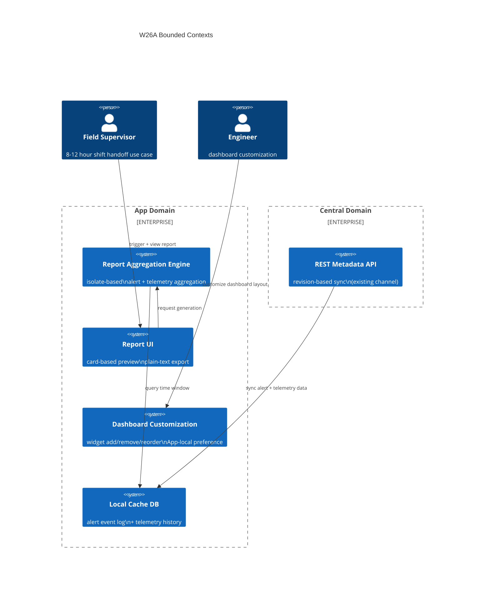

# Context Map — W26A: Shift Reporting & Dashboard Customization

> Wave: App Wave 26A
> Source: `w26-01-shift-reports.md`, `w26-02-dashboard-customization.md`

## Bounded Contexts

## Context Relationships

| Upstream | Downstream | Relationship | Contract |
|---|---|---|---|
| Central REST API (existing) | App Local Cache | Customer/Supplier | revision-based sync; no W26A changes |
| App Local Cache | Report Aggregation Engine | Internal | DB query by time window + device filter |
| Report Aggregation Engine | Report UI | Internal | `ShiftReport` domain model |
| Report UI | Clipboard | External System | plain-text structured output |

## Anti-Corruption Layers

| Boundary | ACL Description |
|---|---|
| Report Engine → UI Thread | Engine runs in isolate; result is passed as immutable `ShiftReport` object to main thread |
| App → Central | W26A does NOT add Central API endpoints; report data is 100% App-local during generation |

## Dependency on Prior Waves

| Prior Wave | Dependency | Nature |
|---|---|---|
| Wave 25A §1 (alert event log) | W26A report pulls alert summary | Must exist before W26A report can run |
| Wave 25A §2 (telemetry history) | W26A report pulls trend highlights | Must exist before W26A report can run |
