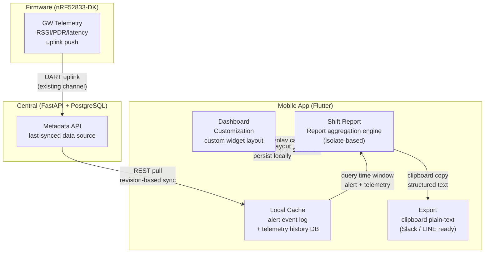

# Ecosystem Map — W26A: Shift Reporting & Dashboard Customization

> Wave: App Wave 26A (App internal planning wave)
> Source: `ble_qos_app/docs/plans/sections/w26-01-shift-reports.md`, `w26-02-dashboard-customization.md`
> Scope: App-local report generation from locally cached data. Does NOT define Central reporting contracts.

## Cross-Repo Actor Responsibilities (W26A)

| Actor | W26A Role | Capability Added |
|---|---|---|
| App | report generation + aggregation engine (isolate); dashboard layout persistence | `ShiftReport` model, `ReportAggregationEngine`, report screens, custom dashboard |
| Central | data source via existing REST sync; no W26A changes | — |
| Firmware | telemetry source via existing uplink; no W26A changes | — |

## Key Invariants (W26A)

- Report data is generated from locally cached data only — no direct Central API calls during report generation
- Aggregation engine runs in isolate to avoid UI thread blocking
- Top-N alerting devices ranked by alert count desc, tie-break by highest severity then most recent alert time
- Cloud sync, email, remote delivery, scheduled auto-generation are explicitly out of scope for W26A
- Dashboard customization is App-local preference — no Central schema changes
