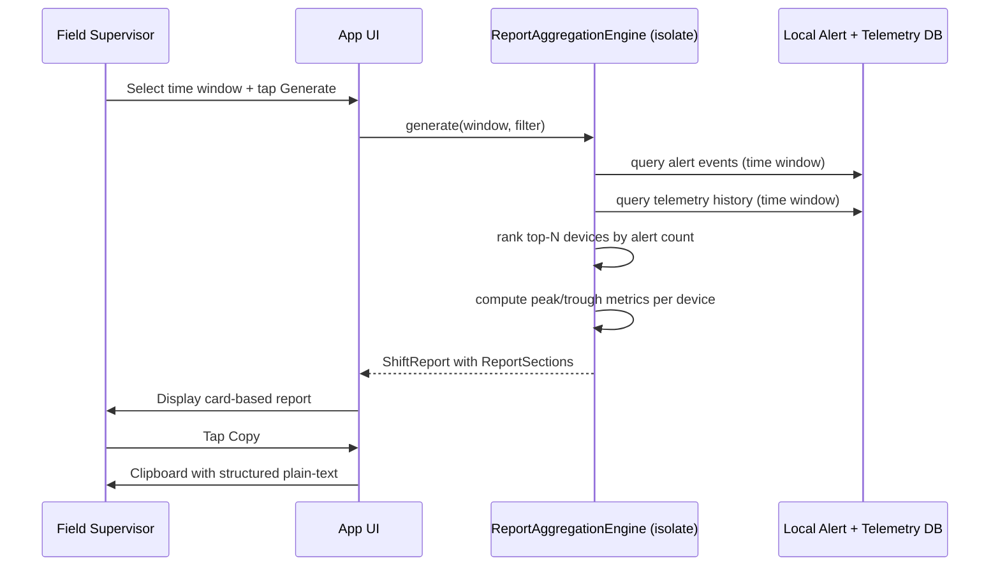

# Event Storming — W26A: Shift Reporting & Dashboard Customization

> Wave: App Wave 26A
> Source: `ble_qos_app/docs/plans/sections/w26-01-shift-reports.md`

## Domain Events

| Event | Trigger | Actor | Outcome |
|---|---|---|---|
| `ReportGenerationRequested` | Engineer/supervisor taps Generate on report trigger screen | App | Aggregation engine started in isolate |
| `TimeWindowSelected` | User selects 4h/8h/12h/custom range | App | Report query parameters set |
| `AlertDataQueried` | Aggregation engine reads alert event log DB | App isolate | Alert count + severity + time per device |
| `TelemetryDataQueried` | Aggregation engine reads telemetry history DB | App isolate | RSSI/PDR/latency/offline duration per device |
| `TopNRanked` | Alert count desc → severity → latest alert time tie-break | App isolate | Ranked device list |
| `ReportSectionsBuilt` | Aggregation complete | App isolate | `ReportSection` objects returned to UI thread |
| `ReportDisplayed` | UI receives sections | App | Card-based scrollable report screen shown |
| `ReportExportedToClipboard` | User taps Copy | App | Structured plain-text copied to clipboard |
| `DashboardLayoutSaved` | User reorders or adds/removes widgets | App | Layout persisted locally (App preference store) |

## Commands

| Command | Actor | Effect |
|---|---|---|
| `ReportAggregationEngine.generate(window, deviceFilter)` | App UI → isolate | Query local DB, produce `ShiftReport` |
| `ShiftReportRepository.save(report)` | App | Persist report for future access |
| `Clipboard.setData(plainText)` | App export | Copy structured report text |
| `DashboardPreferences.save(layout)` | App | Persist widget layout locally |

## Aggregates

| Aggregate | State | Invariant |
|---|---|---|
| `ShiftReport` | id, time_window, included_device_ids, generated_by, sections | Deterministic output for same inputs (reproducible from regeneration_params) |
| `ReportAggregationEngine` | isolate, query cache | Runs off main thread; blocking UI is prohibited |
| `DashboardLayout` | widget list + order | App-local only; no Central sync |

## Sequence: Shift Report Generation

