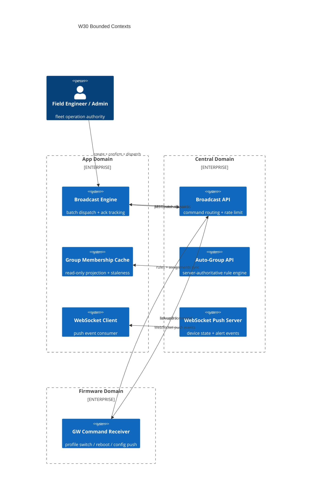

# Context Map — W30: Fleet Broadcast + WebSocket Push

> Wave: App Wave 30
> Source: `w30-01-fleet-broadcast.md`, `w30-02-auto-grouping.md`, `w30-03-websocket-push.md`

## Bounded Contexts

## Context Relationships

| Upstream | Downstream | Relationship | Contract |
|---|---|---|---|
| Central Broadcast API | App Broadcast Engine | Customer/Supplier | REST batch dispatch; per-device ack status |
| Central Auto-Group API | App Group Cache | Published Language | Rule model: criterion_type, value, target_group_id |
| Central WS Push Server | App WS Client | Event-Driven | WS event schema (device state + alert) |
| App Broadcast Engine | GW Firmware | Mediated (via Central) | Central routes; App does not directly reach GW |

## Anti-Corruption Layers

| Boundary | ACL Description |
|---|---|
| App ↔ auto-group rules | App treats rules as read-only; server authority not delegated to App |
| Per-device `acked` | Displayed as in-flight milestone; App must not upgrade to "final state applied" without separate authoritative confirmation |
| WS events ↔ REST data | WS push triggers UI refresh but does not replace REST as authoritative source for conflict resolution |

## Dependencies on Prior Waves

| Prior Wave | Dependency |
|---|---|
| Wave 24A (device groups model) | Group entity model reused by broadcast target selection and auto-group display |
| Wave 29A (sync engine) | Auto-group membership sync uses 29A `SyncEngine` integration point |
