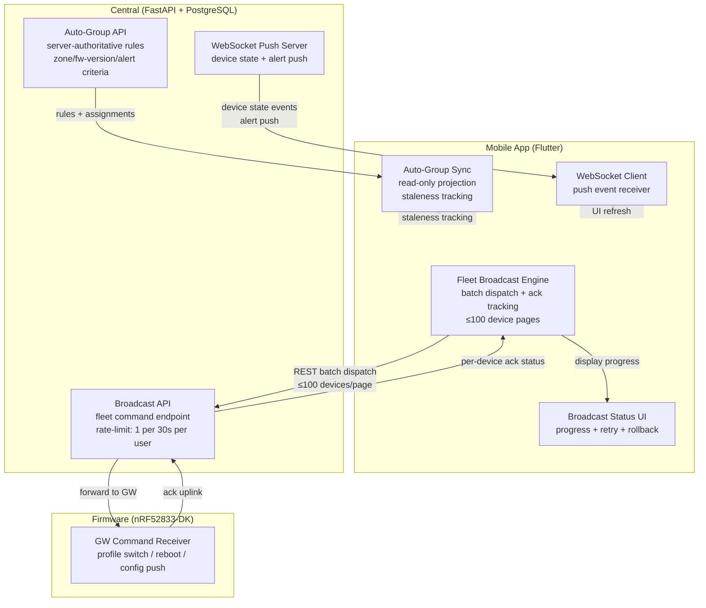

# Ecosystem Map — W30: Fleet Broadcast + WebSocket Push

> Wave: App Wave 30 (Fleet Command Broadcast + Auto-Grouping + WebSocket Push)
> Source: `ble_qos_app/docs/plans/sections/w30-01-fleet-broadcast.md`, `w30-02-auto-grouping.md`, `w30-03-websocket-push.md`
> Dependencies: Wave 24A (device groups), Wave 29A (sync engine), Central broadcast + auto-group API

## Cross-Repo Actor Responsibilities (W30)

| Actor | W30 Role | Authority |
|---|---|---|
| App | fleet broadcast UX; batch dispatch; ack tracking; auto-group display; WebSocket event consumer | UX + local state |
| Central | broadcast API authority; rate-limit enforcement; auto-group rule engine (server-authoritative) | **OWNS** — command routing + group rules + push server |
| GW Firmware | command receiver; executes profile switch / reboot / config push | runtime execution |

## Key Invariants (W30)

- `confirmed` / `dispatched` / per-device `acked` are workflow milestones, **not** final-state-applied (per §1a Truth Boundary Note)
- Auto-group rules are read-only in App; server (Central) is the sole authority
- Rate limit: 1 broadcast per 30s per user; second broadcast returns error (not silently queued)
- Timeout per device: 30s; unacked devices marked as `timeout`
- Rollback command auto-generated for `profile_switch` type
