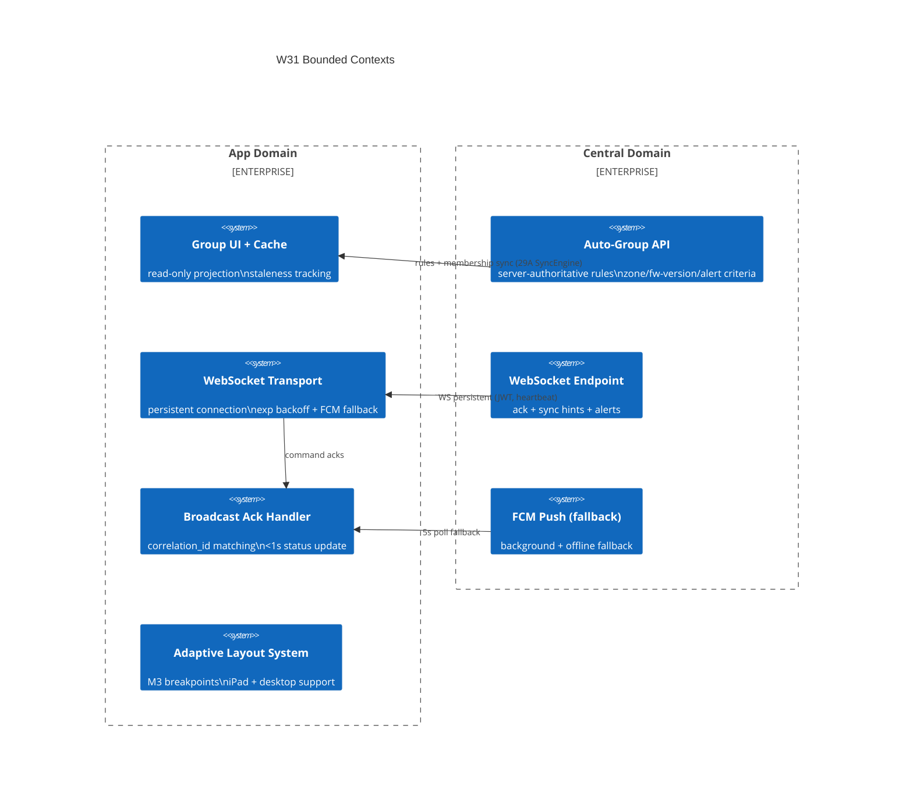

# Context Map — W31: Auto-Grouping + WebSocket Refinement + Adaptive Layout

> Wave: App Wave 31A
> Source: `w31-01-auto-grouping.md`, `w31-02-websocket-push.md`, `w31-03-adaptive-layout.md`

## Bounded Contexts

## Context Relationships

| Upstream | Downstream | Relationship | Contract |
|---|---|---|---|
| Central Auto-Group API | App Group Cache | Published Language | `AutoGroupRule` model: criterion_type, value, target_group_id, priority |
| Central WS Endpoint | App WS Transport | Event-Driven | JWT auth; 30s heartbeat; `correlation_id` ack envelope |
| Central FCM | App Ack Fallback | Published Language | FCM message → 5s poll for missed acks |
| App WS Transport | App Ack Handler | Internal | parsed `WsMessage` envelope |
| Adaptive Layout | All App Screens | Conformist | `AdaptiveScaffold` / `ResponsiveBuilder` consumed by screens |

## Anti-Corruption Layers

| Boundary | ACL Description |
|---|---|
| WS → REST | WS events trigger UI refresh but are not authoritative; missed acks are recovered via REST query on reconnect |
| Group cache → rules | App never mutates group rules; any new rules must come from Central via sync |
| Adaptive migration | `AdaptiveScaffold` wraps existing screens without requiring screen refactoring; phone layout preserved |

## Dependencies on Prior Waves

| Prior Wave | Dependency |
|---|---|
| Wave 24A (device groups model) | Group entity model reused in W31 group UI and auto-group display |
| Wave 28A (FCM push) | W31 WS transport replaces FCM as primary; FCM becomes fallback (migration) |
| Wave 29A (sync engine) | Group membership sync uses 29A `SyncEngine` integration; auth token reused for WS |
| Wave 30A (broadcast engine) | W31 WS ack handler updates broadcast command status created in W30 |
