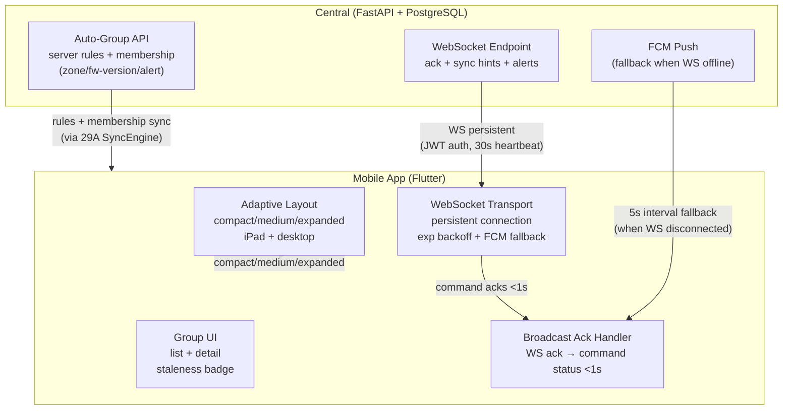

# Ecosystem Map — W31: Auto-Grouping + WebSocket Refinement + Adaptive Layout

> Wave: App Wave 31A
> Source: `ble_qos_app/docs/plans/sections/w31-01-auto-grouping.md`, `w31-02-websocket-push.md`, `w31-03-adaptive-layout.md`
> Dependencies: Wave 24A (groups), Wave 28A (FCM push), Wave 29A (sync engine), Wave 30A (broadcast engine)

## Cross-Repo Actor Responsibilities (W31)

| Actor | W31 Role | Capability Added |
|---|---|---|
| App | auto-group display + WS transport + adaptive layout | group UI with staleness; persistent WS with FCM fallback; responsive breakpoints |
| Central | WS endpoint (command ack + sync hints + alerts); auto-group API authority | WS push infrastructure; authoritative group rules |
| Firmware | no W31 changes | — |

## Key Invariants (W31)

- WebSocket connects on app foreground, disconnects on background (battery-aware design)
- Heartbeat every 30s; 3 missed heartbeats triggers reconnect
- Exponential backoff: 1s→2s→4s→8s→16s→30s cap; after 5 failures fall back to FCM polling (5s interval)
- WS ack must use `correlation_id` to match response to original broadcast command
- Phone layout is pixel-identical regression gate after adaptive layout migration
- Material 3 breakpoints: compact <600dp / medium 600–840dp / expanded >840dp
