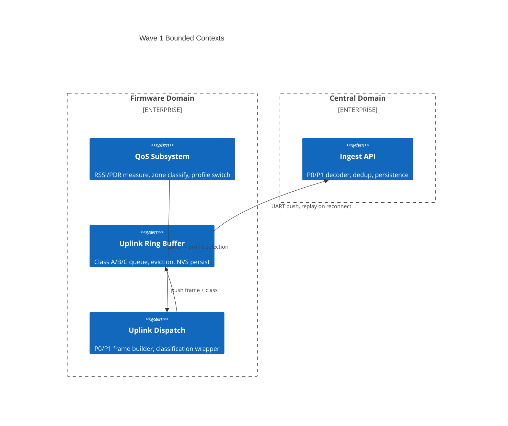

# Context Map — Wave 1: Data Classification + Uplink Buffer

> Wave: Firmware Phase 3 Wave 1
> Source: `capability-ownership.md`, `firmware-phase3-reliability.md`

## Bounded Contexts

## Context Relationships

| Upstream Context | Downstream Context | Relationship | Handoff Contract |
|---|---|---|---|
| QoS Subsystem (Firmware) | Uplink Dispatch | Conformist | `uplink_class_of()` maps type → class |
| Uplink Dispatch | Uplink Ring Buffer | Shared Kernel | `uplink_ring_push(frame, len, class)` API |
| Uplink Ring Buffer | Central Ingest | Published Language | P0/P1 wire format (`dispatch-wire-contract.md`) |
| Central Ingest | Metadata API | Conformist | dedup key = `(gw_mac, boot_id, msg_seq)` |

## Anti-Corruption Layers

| Boundary | ACL Description |
|---|---|
| Ring → Wire | Ring stores raw bytes; dispatch wraps type byte into class before push. Central never sees class label, only wire bytes. |
| Firmware → Central | Central dedup handles replay idempotency; Firmware ring buffer handles local durability. No semantic overlap. |

## Integration Points (Wave 1)

| Interface | Protocol | Source Spec |
|---|---|---|
| GW → Central | UART P0/P1 uplink frames | `dispatch-wire-contract.md` |
| Firmware internal | `uplink_ring` k_spinlock API | `firmware-phase3-reliability.md` Task 3.2 |
| NVS persist | Zephyr settings subsystem | `firmware-phase3-reliability.md` Task 3.5 |
