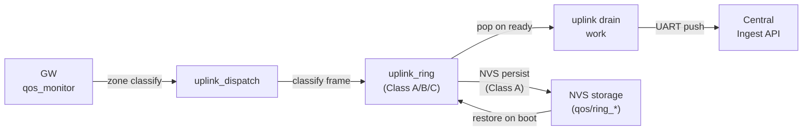

# Event Storming — Wave 1: Data Classification + Uplink Buffer

> Wave: Firmware Phase 3 Wave 1
> Source: `firmware-phase3-reliability.md` Wave 1 Tasks 3.1–3.5, `dispatch-wire-contract.md`

## Domain Events

| Event | Trigger | Class | Wire Type |
|---|---|---|---|
| `UplinkFrameClassified` | `uplink_class_of(type_byte)` called | — | — |
| `ClassAFramePushed` | disconnect/reconnect/alarm dispatched | A | `0x30`/`0x31`/`0x20` |
| `ClassBFramePushed` | metrics/heartbeat/info dispatched | B | `0x10`/`0x32`/`0x21` |
| `ClassCFrameEvicted` | ring full, oldest C dropped | C | diagnostic (future) |
| `ClassBFrameEvicted` | ring full, no C available, oldest B dropped | B | — |
| `ClassAFrameProtected` | ring full, Class A rejected from eviction | A | — |
| `RingBufferPersisted` | `uplink_ring_persist()` NVS write | — | — |
| `ProfileAutoSwitched` | QoS zone change triggers P0↔P1 select | — | — |
| `BackhaulReady` | backend `not-ready → ready` transition | — | — |
| `BufferedFrameReplayed` | drain work pops ring after backhaul ready | — | — |

## Commands

| Command | Actor | Target | Effect |
|---|---|---|---|
| `uplink_dispatch_p0_*()` | GW QoS subsystem | uplink_ring | Push P0 frame with class |
| `uplink_dispatch_p1_*()` | GW QoS subsystem | uplink_ring | Push P1 frame with class |
| `uplink_ring_push(frame, len, class)` | dispatch layer | ring buffer | Enqueue frame |
| `uplink_ring_pop(buf, &len)` | drain worker | ring buffer | Dequeue frame for send |
| `CONFIG_UPLINK_RING_DEPTH` | Kconfig | ring buffer | Set compile-time depth |

## Aggregates

| Aggregate | State | Invariant |
|---|---|---|
| `uplink_ring` | frames array + class tags + head/tail pointers | Class A count never decreases due to eviction |
| `uplink_drain_work` | `k_work_delayable` | Triggered on backhaul ready transition |
| `telemetry_seq` | per-GW `uint32_t` atomic counter | Monotonically increases across dispatches |

## Event Flow Diagram

