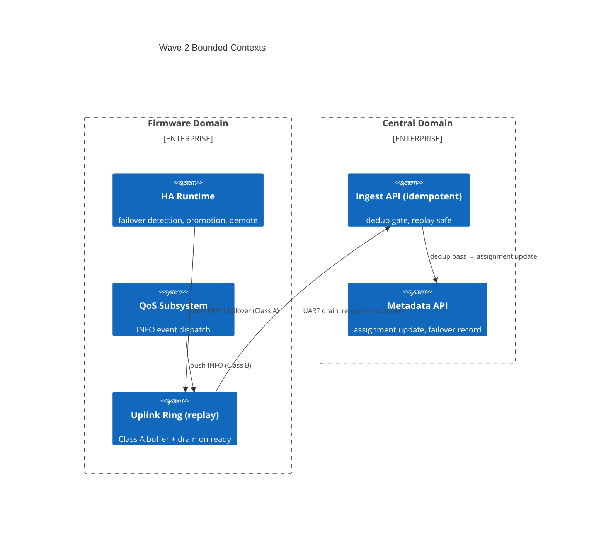

# Context Map — Wave 2: Replay + Event Coverage

> Wave: Firmware Phase 3 Wave 2
> Source: `capability-ownership.md`, `firmware-phase3-reliability.md`

## Bounded Contexts

## Context Relationships

| Upstream | Downstream | Relationship | Contract |
|---|---|---|---|
| HA Runtime | Uplink Ring | Producer | `uplink_dispatch_p0/p1_gw_failover()` API |
| QoS Subsystem | Uplink Ring | Producer | `uplink_dispatch_p0_ed_info()` API |
| Uplink Ring | Central Ingest | Published Language | P0/P1 wire format; idempotent dedup contract |
| Central Ingest | Metadata API | Conformist | Assignment update on failover event receipt |

## Anti-Corruption Layers

| Boundary | ACL Description |
|---|---|
| Ring → Central | Central must not interpret `ed_hash=0` as a valid ED; it is a GW-self sentinel |
| HA → QoS | HA failover events use Class A; INFO events use Class B; these classes have different eviction protection levels |

## Cross-Wave Dependencies

| Dependency | From | To | Nature |
|---|---|---|---|
| Ring buffer module | Wave 1 | Wave 2 | Wave 2 `uplink_ring_push` calls depend on Wave 1 `uplink_ring` implementation |
| Data classification | Wave 1 | Wave 2 | `uplink_class_of()` reused for INFO + failover events |
