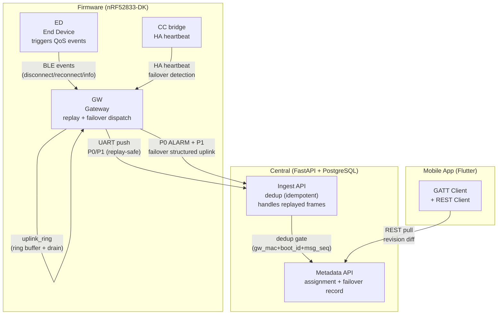

# Ecosystem Map — Wave 2: Replay + Event Coverage

> Wave: Firmware Phase 3 Wave 2
> Source: `firmware-phase3-reliability.md` Wave 2 Tasks 3.6–3.8, `dispatch-wire-p1-families.md`

## Cross-Repo Actor Responsibilities (Wave 2)

| Actor | Wave 2 Role | New Capability Added |
|---|---|---|
| GW (Firmware) | backhaul replay, INFO family dispatch, failover structured uplink | `uplink_drain_work`, `uplink_dispatch_p0_ed_info()`, `uplink_dispatch_p0/p1_gw_failover()` |
| ED (Firmware) | source of QoS events; triggers info/alarm dispatch | `QOS_EVT_TYPE_INFO` call site in `gw_qos.c` |
| CC bridge | HA heartbeat; triggers failover detect in GW | `ha_runtime.c` auto-promote / manual demote |
| Central Ingest | idempotent dedup; receives replayed Class A frames | dedup must handle replay without double-count |
| App | no Wave 2 changes | — |

## Key Invariants (Wave 2)

- Backhaul reconnect triggers automatic ring drain (Class A first, then B)
- Drain batch limit: 4 frames/tick; remainder rescheduled immediately
- INFO family (`0x21`) dispatched as Class B (high-reliability, not critical)
- Failover P0 ALARM uses `ed_hash=0` to denote GW self (not an ED event)
- Failover P1 uses repurposed tail fields — see `dispatch-wire-p1-families.md` Path 7
