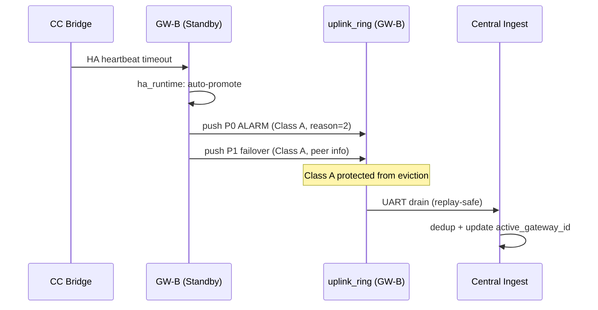

# Event Storming — Wave 2: Replay + Event Coverage

> Wave: Firmware Phase 3 Wave 2
> Source: `firmware-phase3-reliability.md` Tasks 3.6–3.8, `dispatch-wire-p1-families.md` Path 7

## Domain Events

| Event | Trigger | Class | Actor |
|---|---|---|---|
| `BackhaulReadyTransition` | backend `not-ready → ready` | — | GW uplink.c |
| `DrainStarted` | `BackhaulReadyTransition` detected by `s_backend_was_ready` | — | GW drain work |
| `FrameReplayed` | ring pop + UART send on drain cycle | A or B | GW drain work |
| `InfoEventDispatched` | `QOS_EVT_TYPE_INFO` in `gw_qos_on_evt_rx()` | B | GW QoS |
| `GWFailoverDetected` | HA heartbeat timeout or health degraded | — | GW/CC ha_runtime |
| `GWAutoPromoted` | ha_runtime: standby → active (reason=peer_dead) | — | GW ha_runtime |
| `GWManualPromoted` | Central or App command: demote/promote | — | GW ha_runtime |
| `FailoverP0AlarmSent` | `uplink_dispatch_p0_gw_failover(reason, new_role)` | A | GW dispatch |
| `FailoverP1SentWithPeerInfo` | `uplink_dispatch_p1_gw_failover(reason, new_role, old_role, peer_node_id)` | A | GW dispatch |
| `AssignmentUpdated` | Central receives P1 failover frame, updates `active_gateway_id` | — | Central |

## Commands

| Command | Actor | Effect |
|---|---|---|
| `uplink_dispatch_p0_ed_info(info_id, info_data)` | GW QoS | Push INFO Class B frame |
| `uplink_dispatch_p0_gw_failover(reason, new_role)` | ha_runtime | Push P0 ALARM Class A, `ed_hash=0` |
| `uplink_dispatch_p1_gw_failover(reason, new_role, old_role, peer_node_id)` | ha_runtime | Push P1 24B Class A failover record |
| `k_work_schedule(&uplink_drain_work, K_MSEC(50))` | uplink.c | Schedule drain on backhaul ready |

## Aggregates

| Aggregate | State | Invariant |
|---|---|---|
| `ha_runtime` | active/standby + failover_generation | Promotion increments `failover_generation` |
| `uplink_ring` | ring slots + class tags | Class A frames survive backhaul outage |
| `uplink_drain_work` | k_work_delayable | Batch drain ≤ 4 frames/tick |

## Failover Sequence

