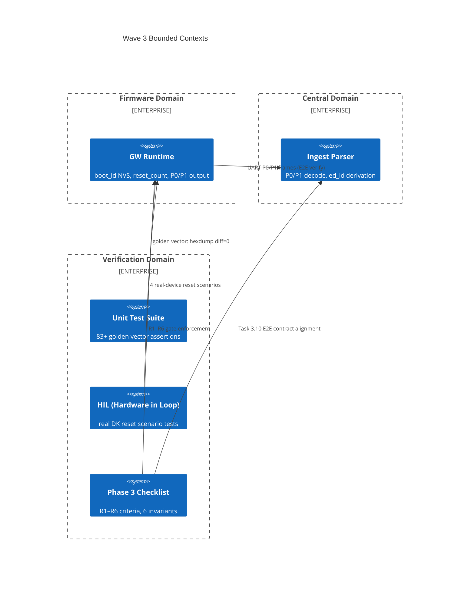

# Context Map — Wave 3: Verification + Convergence

> Wave: Firmware Phase 3 Wave 3
> Source: `phase3-verification-checklist.md`, `firmware-phase3-reliability.md`

## Bounded Contexts

## Context Relationships

| Upstream | Downstream | Relationship | Contract |
|---|---|---|---|
| Firmware Runtime | Central Ingest Parser | Published Language | P0/P1 wire format; `ed:{mac}` identity derivation |
| Unit Test Suite | Firmware | Conformist | golden hex vectors; must match exactly |
| HIL | Firmware | External Test | 4 reset scenarios with RTT log verification |
| Phase 3 Checklist | All | Governance | 28 tests + 6 invariants; gate to Phase 4 |

## Wave 3 Completion Gate

Wave 3 is complete when ALL of the following pass:
1. 83+ unit tests passing in CI docker environment
2. boot_id behavior confirmed for all 4 reset scenarios (real DK)
3. At least 1 E2E path: firmware → UART → Central parser → `ed_id` derivation verified
4. R1–R6 minimum reliability criteria all confirmed
5. `dispatch-wire-contract.md` spec sync complete (no drift between spec and implementation)
