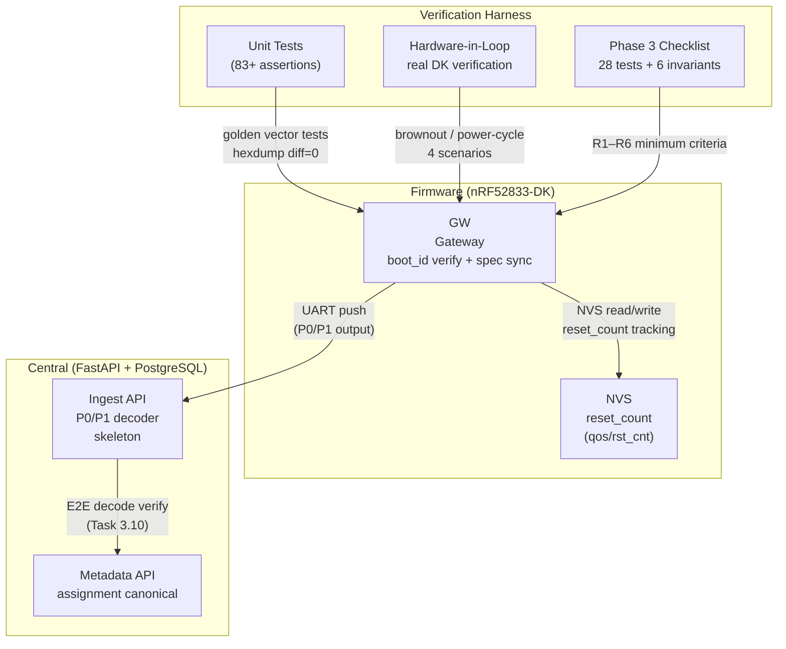

# Ecosystem Map — Wave 3: Verification + Convergence

> Wave: Firmware Phase 3 Wave 3
> Source: `firmware-phase3-reliability.md` Wave 3 Tasks 3.9–3.10, `phase3-verification-checklist.md`

## Cross-Repo Actor Responsibilities (Wave 3)

| Actor | Wave 3 Role | Verification Scope |
|---|---|---|
| GW Firmware | boot_id brownout verification, wire format spec sync | 4 reset scenarios × boot_id behavior |
| Central Ingest | P0/P1 E2E decode contract alignment | At least 1 E2E path: firmware → UART → Central parser |
| Verification Harness | golden vector tests, HIL real-device tests | R1–R6 reliability criteria |
| Firmware Spec | spec sync with checklist invariants | `dispatch-wire-contract.md` 28-test suite |

## Key Invariants (Wave 3 Gate)

| ID | Criterion | Metric |
|---|---|---|
| R1 | Class A not silently dropped | ring eviction never touches Class A |
| R2 | Wire bytes unchanged through buffer | hexdump diff = 0 |
| R3 | FIFO order preserved within class | pop order = push order |
| R4 | Class A survives backend outage | ring holds until backend ready |
| R5 | Class A survives reboot (NVS persist) | restore count = persist count |
| R6 | Profile auto-switch doesn't change wire format | P0/P1 byte layout unchanged |
