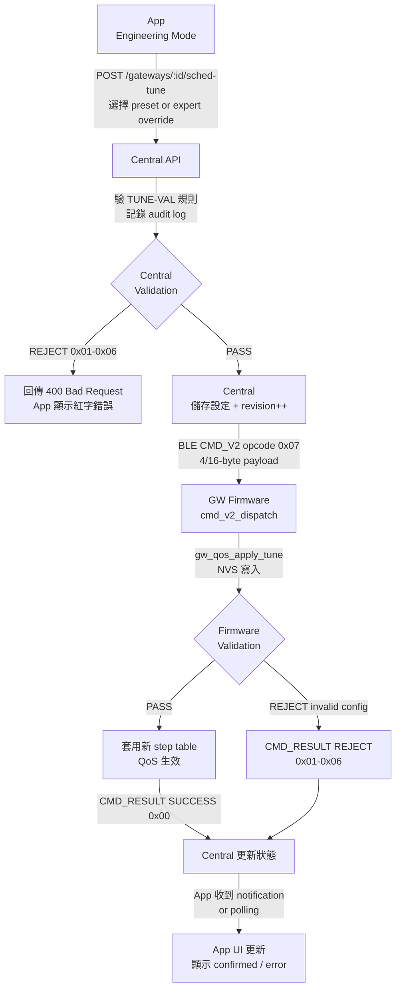

<!--
AI-DIAGRAM: required
primary_message: App 更改 preset → Central 記錄 → CMD_V2 送 GW → Firmware 套用 → 結果回 App
reader: engineer
template_id: flow-linear-gate
diagram_type: flowchart
layout: top-to-bottom
max_nodes: 9
max_groups: 3
keep: preset選擇、Central audit、CMD_V2 dispatch、NVS寫入、CMD_RESULT回傳
avoid: validation細節、reject codes展開、BLE wire encoding
-->

# F-04 End-to-End 流程圖

**主訊息**：Operator 在 App 選擇 QoS preset，經 Central 記錄後透過 CMD_V2 送到 GW，Firmware 套用並回報結果。

**說明**：流程展示 F-04 scheduler tuning 的端對端路徑。Central 是第一道驗證關卡（TUNE-VAL），Firmware 是最終 guard。CMD_RESULT 成功後 App UI 才轉為 `confirmed` 狀態。Busy guard（0xFD reject）見 [`seq-cmd-v2-reject-busy.md`](../sequence/seq-cmd-v2-reject-busy.md)。

**Reference**：
- Spec: [`../../../shared-spec/feature-gw-qos-scheduler-tuning.md`](../../feature-gw-qos-scheduler-tuning.md)
- Validation rules: `TUNE-VAL-001` ~ `TUNE-VAL-006`
- ADR: `--base-dir/docs/decisions/2026-04-18-f04-runtime-preset-over-build-assert.md`
