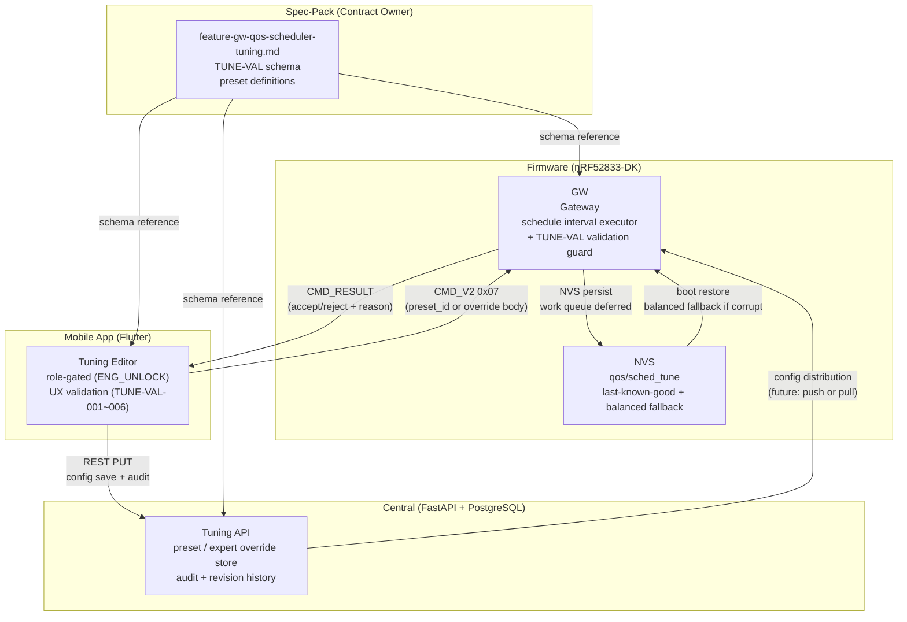

# Ecosystem Map — F-04: GW QoS Scheduler Tuning

> Feature: F-04 GW QoS Scheduler Deployment Tuning
> Cross-repo feature (Spec-pack owner). Related: FW-3A, FW-3B, FW-4, FW-5 (Firmware); A-1~A-6 (App); C-1 (Central)
> Source: `shared-spec/feature-gw-qos-scheduler-tuning.md`, `capability-ownership.md` RML-CAP-006

## Cross-Repo Actor Responsibilities (F-04)

| Actor | F-04 Role | Authority |
|---|---|---|
| Spec-Pack | TUNE-VAL schema, preset definitions, cross-repo contract | Contract owner (RML-CAP-006) |
| Central | runtime deployment config truth, audit, revision history | **OWNS** — config storage + distribution |
| App | role-gated tuning editor UX, TUNE-VAL client validation | editor UX only; cannot bypass validation |
| GW Firmware | CMD_V2 0x07 receiver, TUNE-VAL final guard, apply + reject | execution + final validation guard |
| NVS | last-known-good fallback storage | local durability only |

## Key Invariants (F-04)

- App shows red error and disables Save/Apply on invalid TUNE-VAL (client-side guard)
- Firmware **must** reject invalid applied config via `CMD_RESULT` (final guard, `TUNE-VAL-005`)
- Central cannot skip validation; invalid config must not be persisted
- Balanced preset is boot fallback if NVS corrupt
- ENG_UNLOCK PIN required for editor access (L3 engineer only)
