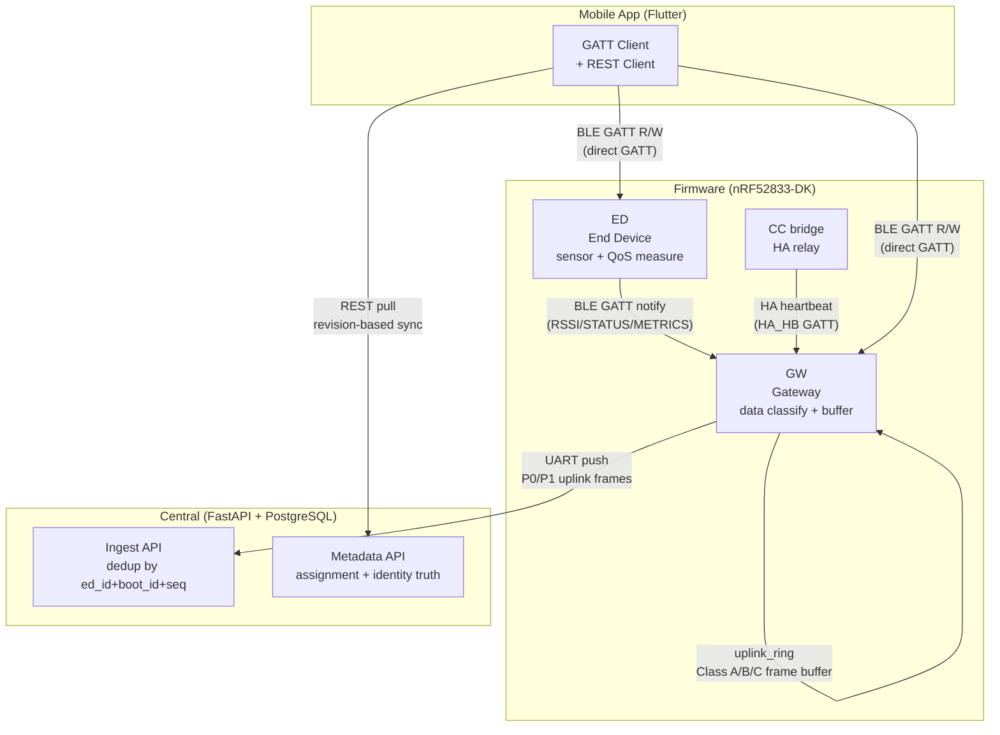

# Ecosystem Map — Wave 1: Data Classification + Uplink Buffer

> Wave: Firmware Phase 3 Wave 1
> Source: `shared-spec/rml-lite.md` actors/authority, `firmware-phase3-reliability.md` Wave 1

## Cross-Repo Actor Responsibilities (Wave 1)

| Actor | Wave 1 Role | New Capability Added |
|---|---|---|
| GW (Firmware) | uplink data classification + ring buffer eviction | `uplink_class_of(type_byte)`, `uplink_ring` module |
| ED (Firmware) | runtime sensor source, unchanged | — |
| CC bridge | HA relay, unchanged | — |
| Central Ingest | P0/P1 frame decoder, consumes buffered frames | dedup by `(gw_mac, boot_id, msg_seq)` |
| App | BLE GATT read, no Wave 1 changes | — |

## Key Invariants (Wave 1)

- Class A frames (`0x30` disconnect, `0x31` reconnect, `0x20` alarm) are **never** silently dropped
- Wire bytes through ring buffer are byte-identical to pre-buffer output
- Ring buffer depth: `CONFIG_UPLINK_RING_DEPTH` (default 48), see firmware `Kconfig`
- Eviction order: oldest Class C → oldest Class B → reject (Class A protected)
